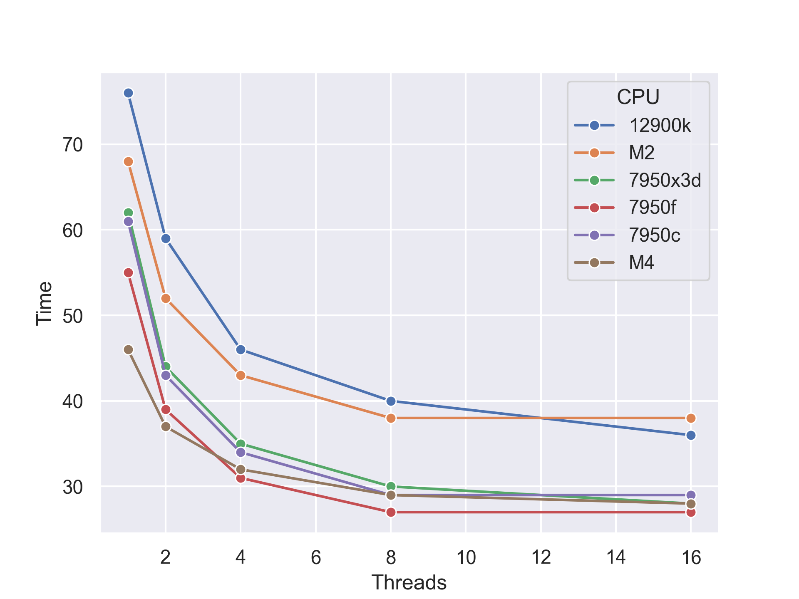

## About

Neuroimaging is a powerful tool for understanding the function of the healthy brain, pathology, the consequences of aging, guiding treatment, and evaluating treatment. However, the analysis of brain imaging data is very compute intensive. Neuroimaging teams make large investments in the computers used for image processing. The objective of this page is to evaluate different architectures for analysing brain imaging data.

For example, when purchasing a 32-core server, the competition includes the AMD EPYC 9374F (256mb L3, 3.85-4.1GHz, 320w, $4,780), or 9384X (768mb L3, 3.1-3.5GHz, 320w, $5529), versus the Intel [Sapphire Rapids based Xeon Platinum](https://en.wikipedia.org/wiki/Sapphire_Rapids) 8462Y (60mb cache, 2.8-4.1GHz, 300w, $5945, 2 socket) or 8454H (82.5mb cache, 2.1-3.7GHz, 270w, $6540, 8 socket). Note the tradeoff in the AMD CPUs: one can choose the faster 9374F or the larger cache of the 9384X. The large cache can benefit [some tasks, but not others](https://www.anandtech.com/show/18747/the-amd-ryzen-9-7950x3d-review-amd-s-fastest-gaming-processor/4). Therefore, it is worth evaluating how different vendors (AMD vs Intel) and different tradeoffs (cache versus speed) influence neuroimaging pipelines. Many 3D neuroimaging operations such as spatial normalization, Gaussian blur and matrix-based statistics would seem to benefit from larger caches. However, many of the operations are too large to fit into any cache, and the data is often read in a predictable, sequential order. Here we evaluate the 7950x3d which has 8 fast cores and 8 cores (using the same architecture as the  9374F and 9384X)that have access to a lot of cache, [where we can independently turn off cores](https://www.techpowerup.com/review/ryzen-7800x3d-performance-preview/) to directly measure the impact of cache and speed on the tools of our field. Here we also test an Intel i9 12900ks, which uses the same architecture as the 8462Y and 8454H.

Neuroimaging servers tend to choose either Intel or AMD CPUs, as these benefit from a complete ecosystem of tools and have access to NVidia GPUs that dramatically accelerate some tasks (e.g. bedpost, eddy, probtrackx). We have previously described the potential for [ARM-based Apple CPUs](https://github.com/neurolabusc/AppleSiliconForNeuroimaging) and include the Apple M2 CPU here for reference. Indeed, [NVidia is introducing ARM-based CPUs with their CUDA GPUs](https://www.nvidia.com/en-us/data-center/grace-hopper-superchip/) which may be a long-term game changer, but is beyond the scope of this page.

While some of the tests below evaluate the influence of multiple threads to accelerate processing, it is worth emphasizing that most server-based neuroimaging is intentionally single threaded. Most neuroimaging studies acquire data from many individuals, and the data from each individual is processed independently on a single thread. Therefore, the parallelism is based on analyzing data from multiple individuals in parallel. Therefore, the `Single Threaded Pipeline` sections below are most relevant for server purchases.

## Testing

Three computers were tested, with a ram disk used to minimize IO differences:

 - MacBook Pro 16 (2022) with [Apple M2 Pro](https://en.wikipedia.org/wiki/Apple_M2) 12 (8+4) core, L2 32mb, L3 24 mb, maximum bandwidth 200 GB/s, 3.5GHz, integrated GPU. 
 - AMD [Ryzen 7950x3d](https://en.wikipedia.org/wiki/List_of_AMD_Ryzen_processors#Raphael_(7000_series,_Zen_4_based)) 16 core, L2 16mb, L3 128 mb (8 fast cores share 32mb, 8 share 96mb), 64Gb DDR4 6000, Ubuntu 23.04, 4.2-5.5 Ghz. We refer to this chip as `7950x3d` when all 16 cores are enabled, `7950f` when only the fast 8 cores are enabled, and `7950c` when only the 8 cores with the extra 3D cache are enabled.
 -  Intel [I9 12900ks](https://en.wikipedia.org/wiki/List_of_Intel_Core_i9_processors#Alder_Lake_(Intel_7,_12th_generation)) 16 core (8 efficiency), L2 14mb, L3 30 mb , 64Gb DDR3 3200, Ubuntu 23.04, 3.4-5.5 Ghz. We refer to this chip as `7950x3d` when all 16 cores are enabled, `7950f` when only the fast 8 cores are enabled, and `7950c` when only the 8 cores with the extra 3D cache are enabled.

## AFNI Parallel Processing

[AFNI](https://afni.nimh.nih.gov) is a popular software suite for brain imaging. It is a collection of executables written in C. It can be compiled to run natively on the Apple Silicon CPUs. AFNI provides a [`Bigger Speed Test`](https://sscc.nimh.nih.gov/afni/doc/misc/afni_speed/index_html). This benchmark tests [3dDeconvolve](https://afni.nimh.nih.gov/pub/dist/doc/program_help/3dDeconvolve.html) where most of the computations can be run in parallel, but where [Amdahl's law](https://en.wikipedia.org/wiki/Amdahl%27s_law) incurs diminishing returns with increasing number of threads. For the Ryzen 7950x3d the faster cores outperform the large cache cores.



## AFNI (Mostly) Single Threaded Pipeline

The graph below shows the total time to compute the [AFNI_data6 s01.ap.simple script](https://afni.nimh.nih.gov/pub/dist/doc/htmldoc/background_install/unix_tutorial/misc/install.data.html). This is a complete pipeline, analyzing fMRI activity observed in 452 volumes of data. Some programs like 3dClustSim use OpenMP acceleration, while many stages are single-threaded. This is a nice demonstration of the real world performance of this architecture for a typical dataset.

```
Rank   System/CPU                (sec)
AMD 7950f 8-core (fast)           252
AMD 7950c 8-core (big cache)      273
AMD 7950x3D 16-core               283
Intel 12900k 16-core (8 big)      365
```

## FSL Single Threaded Pipeline

FSL is a popular pipeline for neuroimaging analysis. The [FSL Evaluation and Example Data Suite (FEEDS)](https://fsl.fmrib.ox.ac.uk/fsl/fslwiki/FEEDS) is a regression test for the core tools. This suite has expanded over the years to include new tools, so times are specific to the version being tested (here 6.0.5).

```
Rank   System/CPU                  (sec)
Apple M2 Pro 12-core (8 big)        345
AMD 7950x3D 8-core (fast)           372
AMD 7950x3D 16-core                 385
AMD 7950x3D 8-core (big cache)      396
Intel 12900k 16-core (8 big)        546
```

One could argue that feeds is designed to validate the accuracy of each tool, with relatively small datasets. A more realistic test is the registration dataset from the [FSL training course](https://open.win.ox.ac.uk/pages/fslcourse/website/index.html) which computes the complex spatial preprocessing for a typical modern dataset.

```
Rank   System/CPU                  (sec)
Intel 12900k 16-core (8 big)        706
Apple M2 Pro 12-core (8 big)        796
AMD 7950f 8-core (fast)             788
AMD 7950x3D 16-core                 806
AMD 7950c 8-core (big cache)        879
```

## POSIX Threads (pthreads)

[POSIX Threads](https://en.wikipedia.org/wiki/POSIX_Threads) is a low-level method for handling parallel threads. Here we test [C-Ray](https://github.com/neurolabusc/c-ray) a simple raytracing benchmark by [John Tsiombikas](https://github.com/jtsiomb) that provides a measure of parallel floating point CPU performance. The small size means it can be [contained in cache](http://www.sgidepot.co.uk/c-ray.html), so it is not a great measure of typical performance with real world datasets. On the other hand, it is very portable and has been used for many years. This allows us to make historical comparisons. Specifically, here we provide data for [SGI Depot Test 3](http://www.sgidepot.co.uk/c-ray.html).

```
Rank   System/CPU                  (msec)  Threads
Ampere Altra A1 3.0GHz 160-core       413     200
AMD 7950x3D 16-core                  1245     120
Intel 12900k 16-core (8 big)         1548     120
Apple M2 Pro 12-core (8 big) 3.7GHz  1640      64
Apple M2 Pro 12-core (8 big) 3.7GHz 14014       1
Intel 12900k 16-core (8 big)        16257       1
AMD 7950x3D 16-core                 18691       1
Ampere Altra A1 3.0GHz 160-core     34563       1
```

## CUDA graphics cards

A handful of neuroimaging tools are dramatically accelerated by using a CUDA-compatible graphics card (GPU) rather than the central processing unit (CPU). This includes the FSL tools [Bedpostx](https://journals.plos.org/plosone/article?id=10.1371/journal.pone.0061892), [Eddy](https://fsl.fmrib.ox.ac.uk/fsl/fslwiki/eddy/UsersGuide) and [Probtrackx](https://www.sciencedirect.com/science/article/pii/S1053811918321591). However, in our experience these tools perform similarly with consumer-grade GPUs and much more expensive professional grade GPUs (which provide features like high-bandwidth memory and faster double precision floating point computations). Indeed, while these GPU-based tools are dramatically faster than their CPU-based counterparts, looking at tools like nvidia-smi suggests that these GPU tools are often limited by the data transfer to the CPU. This suggests that their may be rapidly diminishing returns when selecting a graphics card for neuroimage. Here we evaluate the speed for processing our [gpu_test](https://github.com/neurolabusc/gpu_test). These tests were designed simply to ensure the graphics cards were working, so are faster that real world applications, but they are similar in the processing. We tested two graphics cards on a single computer (the i9 12900k) which used the integrated graphics for the display (so the GPU was dedicated for processing).  

| Test          | RTX3060 (sec) | RTX3090 (sec) |
| ------------- | ------------- | ------------- |
| Bedpostx      | 75            | 69            |
| Eddy          | 34            | 34            |
| Probtrackx    | 175           | 178           |

We did not find a dramatic performance difference between the $1500 RTX3090 with 24 Gb and the $329 RTX3060 with 12 Gb. There still may be benefits for graphics cards when considering machine learning inference.


## Conclusions

 - In aggregate, AMD's 3D cache does not appear to benefit thetools used in neuroimaging, so the EPYC 9374F is likely to out perform the more expensive 9384X.
 - No CPU evaluated dominated the results, and each appears competitive. In this test, single threaded tasks were done an otherwise dormant system (allowing unrestricted boost of a single thread), while typical servers will be running many concrurrent tasks. 
 - Empirically, Apple M2 has excellent single-threaded performance. This likely reflects its prodigious bandwidth (among other benefits). Clearly, MacBooks provide a great platform for developing pipelines to be deployed for large datasets on the cloud and servers. Unfortunately, some neuroimaging tools rely on NVidia's CUDA that is not available on MacOS. It will be interesting to see how [NVidia ARM-based CPUs with CUDA GPUs](https://www.nvidia.com/en-us/data-center/grace-hopper-superchip/) compete in this domain.

## Links

 - Anandtech [Ryzen 7950x3d review](https://www.anandtech.com/show/18747/the-amd-ryzen-9-7950x3d-review-amd-s-fastest-gaming-processor/4)
 - Puget Systems [Ryzen 7950x3d for content creation](https://www.pugetsystems.com/labs/articles/amd-ryzen-9-7900x3d-and-7950x3d-content-creation-review/).
 - Phoronix [EPYC 9684X review](https://www.phoronix.com/review/amd-epyc-9684x-benchmarks)
